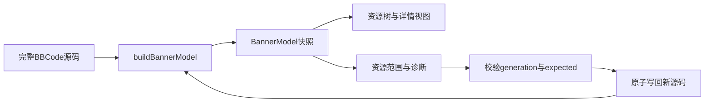

# Banner Block/Slot 数据模型

本文面向开发者，说明 `BannerModel` 的结构、身份、生命周期、资源视图和编辑事务。版头作者应先阅读 [Block/Slot 扩展语法规范](./extension-syntax.md)。

## 1. 模型定位

`BannerModel` 是一份 BBCode 源码快照对应的规范化、只读语义模型。唯一公开解析入口是 `buildBannerModel(text)`。渲染器每次更新资源时都会根据完整源码重新构建模型；资源树和详情面板是模型的派生视图，不是第二个数据源。

解析器只为 `[comment // $...]` 创建扩展 token。去除 `//` 后的首个语义字符不是 `$` 时，该 comment 是普通注释，不参与 prefix、suffix、名称、默认声明或扩展诊断处理。`$` 是命名空间前缀，不属于 `name` 或 `nameRange`。

## 2. 根对象和解析结果

模型根对象包含：

- `generation`：当前完整源码快照的指纹。
- `snapshot`：参与本次解析的完整源码文本。
- `range`：全文的 UTF-16 半开范围。
- `rootBlock`：资源树的根 Block。
- `blocks`：按逻辑身份索引的 Block 集合。
- `slots`：ImageSlot、TextSlot 和 LinkSlot 的集合。
- `styleBlocks`：`!属性` 声明形成的 StyleBlock 集合。
- `defaultDeclarations`：文档级图片默认声明。
- `diagnostics`：结构、冲突和默认值相关的诊断。
- `tokensById`：扩展标记及其配对关系的索引。

所有范围都使用 UTF-16 半开区间 `[start, end)`。范围只对创建它的 `snapshot` 和 `generation` 有效。

## 3. Block、Slot 和 StyleBlock

### 3.1 Block

Block 是逻辑容器。前缀栈（`++名称` / `--名称`）和后缀栈（`名称++` / `名称--`）共同形成资源路径。对普通图片、文本和链接资源，完整路径最后一级是 Slot 名，之前的所有段都是 Block。

同一父 Block 下、名称相同的 Block 按逻辑路径合并。每个目录段会在 `sourceOccurrences` 中保留源码来源，因此一个 Block 可以对应多组分离的打开和关闭标记。没有命名 comment 的资源进入保留逻辑 ID 为 `__system_uncategorized__` 的虚拟 Block。

### 3.2 Slot

Slot 的唯一键由“父 Block 逻辑路径 + 资源类型 + Slot 名称”组成。图片、文本和链接分别形成不同类型的 Slot；不同类型即使名称相同，也不是同一个 Slot。

正常 Slot 只有一个有效 `source`。如果出现相同唯一键，后来的来源不会覆盖前者，而是加入 `slot.conflicts`，并生成 `duplicate-slot` 诊断。冲突来源仍保留精确的源码范围、行号、Slot ID 和资源来源，供界面定位。

ImageSlot 的 `source` 还会保存精确的 `urlRange`，因此拖放图片或编辑图片 URL 时可以只替换 URL，不破坏 `img` 或 `dybg` 的其他结构。

### 3.3 StyleBlock

`[comment // $名称!属性]` 不形成 Slot，而形成 StyleBlock。StyleBlock 保存属性类型、原始标签内容和可编辑字段。其父路径依据 `!属性` comment 的位置派生，suffix 场景遵循同一规则。

## 4. 图片默认声明和派生状态

`[comment // $#名称!图片 = 值]` 是文档级图片默认声明。相同名称重复声明时按源码顺序处理，最后一个声明生效；被覆盖的声明会记录 `shadowedByTokenId`，生效声明会记录 `shadowsTokenId`，并生成 `shadowed-default` 警告。

默认值只按 ImageSlot 的最终名称匹配，不按完整路径匹配，也不作用于其他资源类型。

Slot 的 `valueState` 是根据源码实际值和有效默认值派生的结果，不保存为额外的源码标记：

- `disabled`：实际值为空。
- `default`：实际值非空，并逐字符等于有效默认值。
- `manual`：其他非空实际值；没有默认声明的非空值也属于此状态。

因此，默认值变化或实际值变化后，状态应在重新解析模型时重新计算。

## 5. 身份、指纹和生命周期

模型区分逻辑身份与内容变化：

- `logicalId`：由父逻辑路径、节点类型和名称确定，表示模型中的逻辑节点。
- `stableId`：供资源树和界面绑定使用的稳定身份。正常资源通常与逻辑身份一致；冲突资源会追加冲突序号。
- `contentFingerprint`：由资源源码范围对应的文本切片生成，用于检测内容变化。
- `generation`：当前完整源码快照的指纹，用于判断旧解析结果是否仍然适用。

字段值变化不应改变正常资源的逻辑身份，因此图片 URL 修改后，资源树选择、目录折叠和滚动锚点可以继续定位同一资源。名称或路径变化会改变逻辑身份，并触发资源树重新派生。

模型生命周期如下：

编辑发生后，旧模型的范围、`generation` 和 `expected` 不得继续用于新的写回操作。

## 6. 诊断

模型诊断覆盖以下情况：

- prefix 或 suffix 未闭合。
- 关闭标记没有对应的打开标记。
- 关闭名称不匹配或发生交叉关闭。
- `!属性` 后缺少可读取的属性标签。
- `!文本` 不在可匹配的 style 包裹中，或找不到同一行的关闭标签。
- 同名图片默认声明被后声明覆盖，产生 `shadowed-default` 警告。
- 同一父路径、类型和名称重复，产生 `duplicate-slot` 错误。

未命名的 `dybg`、`img` 和 `url` 会进入“未分类”虚拟 Block。它们可以被查看和编辑，但没有可重命名的扩展 token。

## 7. 资源视图派生

渲染器从以下模型内容派生资源树和详情绑定：

- `model.rootBlock`：目录树结构。
- `model.slots`、`model.styleBlocks`：可编辑资源集合。
- Slot 的 `source` 和 `conflicts`：源码范围、实际值、名称 token 和冲突信息。
- `model.diagnostics`：错误和警告显示。

这些对象是轻量视图数据，不拥有独立的解析逻辑或生命周期。目录节点、资源行和详情面板的选择状态由 `stableId` 关联；图片拖放使用 ImageSlot 的 `urlRange` 进行替换。

Block 重命名使用 `sourceOccurrences` 中的名称 token。Slot 和 StyleBlock 的 source 会显式保存 `nameTokenId`、`nameToken`、`pairedNameTokenId` 和 `pairedNameToken`：普通 Slot 使用普通名称 token，suffix Slot 使用 suffix 打开 token 及其配对关闭 token，StyleBlock 使用 `!属性` 名称 token。未分类 source 没有名称 token，因此不能通过目录树重命名。

## 8. 编辑事务和界面状态

每个可编辑资源都应携带以下写回信息：

- `source`：资源当前有效来源。
- `range`：整体资源或属性的源码范围。
- `urlRange`：ImageSlot 的精确图片 URL 范围。
- `expected`：解析时范围内的原始文本。
- `stableId`：用于资源选择和视图恢复的稳定身份。

执行编辑时，渲染器会：

1. 使用当前模型快照创建一个或多个替换项。
2. 验证 `generation`、范围边界、`expected` 文本和替换区间是否重叠。
3. 将同一操作的多个替换作为一个原子事务写回编辑器。
4. 根据新源码重新构建 `BannerModel`。
5. 恢复当前资源选择、资源树滚动锚点、详情面板滚动位置和必要的输入焦点。

如果源码已被手工修改或其他操作更新，generation 或 expected 校验失败，编辑器不会使用旧范围写回，而会先要求重新解析。

## 9. 图片管理器上下文

图片管理器通过 preload IPC 使用独立的媒体上下文执行加载、上传、命名和删除。媒体上下文包含图片帖子正文、附件列表和图片资源状态，不与主编辑器的帖子上下文共享当前正文。

图片身份会归一化相对路径、完整 URL 和不同尺寸形式，避免重复资源。附件路径最后一个字符为下划线时被视为 NGA 删除残留，不会重新合并到资源列表。删除附件后，正文清理遵循删除成功或附件确认不存在的结果。

## 10. 实现约束

- 模型的 range 使用 UTF-16 单位，不能直接按字节偏移使用。
- 解析结果只对对应的源码快照和 generation 有效。
- 资源树只能消费模型派生数据，不能作为独立数据源保存资源值。
- 扩展 comment 与目标资源的同一行限制由解析规则决定，详见语法规范。
- 模型只组织和编辑资源，不负责判断 NGA 是否支持具体 BBCode 标签或属性值。